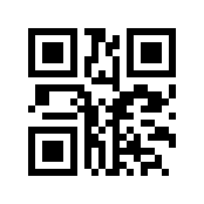
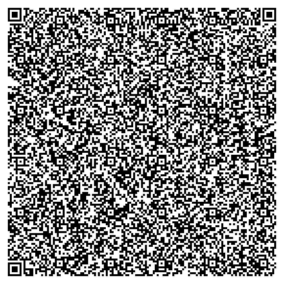
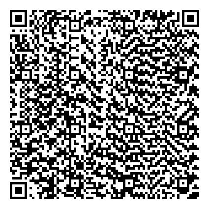
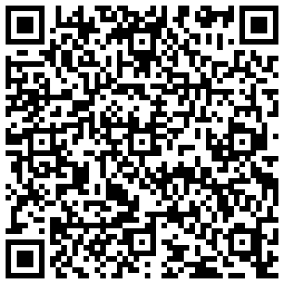

## Python implementation of QR code generator.

The module generates QR Code from text file or stdin. The output image can be saved, displayed or both.


### Requirements:

`Python 3`

#### External libraries:

`numpy`, `PIL`


### Usage examples:
  * #### Create QR code from stdin and save the image.
  
  There's only input message `[-i]` and output file name `[-o]` required and we are good to go. All the remaining parameters will be set automatically, based on the message length and its type (number, UTF-8, ASCII, etc.). 
  ```bash
  $ python3 qr_code.py -i "Hello world" -o "stdin_sample.png"
  ```
  
  ```bash
    [+] Latin-1 encoding applied.
    [+] QR version: 1 chosen.
    [+] Error Correction Level: Q chosen.
    [+] Best mask has been applied: [2]. With 342.0 penalty
    QR saved at: /absolute/path/to/the/stdin_sample.png
  ```


  * #### Create QR code from a text file `[-f]` and display the image `[-d]`. We do not save it this time. <br/>Set the scale flag `[-s]` to control the output image size.
  
  ```bash
  $ python3 qr_code.py -f samples/sample_text.txt -d -s 4
  ```
  
  ```bash
    [+] UTF-8 encoding applied.
    [+] QR version: 30 chosen.
    [+] Error Correction Level: Q chosen.
    [+] Best mask has been applied: [2]. With 12380.0 penalty
  ```



  * #### Set QR code version and error correction level.

    If a message is too long to meet version `[-v]` and error correction level `[-e]` constraints, the following error will be raised.
    
    ```bash
    AssertionError: Message too long (7716) for a given version capacity (104)
    ```
    When we pass incorrect values, another error will be raised.
    
    ```bash
    qr_code.py: error: argument -v: Value out of range: 1111. Should be between 1 and 40.
    ```
    If these values are correct, then we should see the expected output image.

    ```bash
    $ python3 qr_code.py -i "Hello world" -d -s 5 -v 15 -e 2
    ```

    ```bash
    [+] Latin-1 encoding applied.
    [+] QR version: 15 chosen.
    [+] Error Correction Level: Q chosen.
    [+] Best mask has been applied: [4]. With 3546.0 penalty
    ```



  * #### Setting QR code mask and quiet zone values.
  It's not recommended to set a mask value `[-m]` if you want to be sure that the best one is chosen. It will however speed up generating QR codes noticeably. Quiet zone value `[-z]` determines width of white space around QR code.

```bash
  $ python3 qr_code.py -i "https://github.com/abcs-ab" -d -s 7 -v 8 -e 3 -m 3 -z 1
```

```bash
  [+] Latin-1 encoding applied.
  [+] QR version: 8 chosen.
  [+] Error Correction Level: H chosen.
```



  * #### Last but not least, the `[-h]` flag.

    ```bash
    $ python3 qr_code.py -h
    ```

    ```
    usage: qr_code.py [-h] [-v VERSION] [-e EC LEVEL] [-m MASK] [-s SCALE IMAGE]
                      [-i INPUT TEXT | -f INPUT FILE NAME] [-o OUTPUT IMAGE NAME]
                      [-z QUIET ZONE] [-d]

    Create QR Code from text file [-f] or stdin [-i] and save as an image.
    When version is to be chosen automatically, then it's worth noting, 
    that keeping declared error correction level will be a priority.
    So, qr version will be increased first, before error correction level
    is lowered in order to fit a message.

    optional arguments:
      -h, --help            show this help message and exit
      -v VERSION            Valid values from 1 to 40. If omitted, version is computed automatically.
      -e EC LEVEL           Valid values from 0 to 3. Default 2.
                            0 - Level L (Low)         ~7% of codewords can be restored.
                            1 - Level M (Medium)      ~15% of codewords can be restored.
                            2 - Level Q (Quartile)    ~25% of codewords can be restored.
                            3 - Level H (High)        ~30% of codewords can be restored.
      -m MASK               Valid values from 0 to 7. Default None.
      -s SCALE IMAGE        Takes positive integer. Image is resized according to this value. Default 10.
      -i INPUT TEXT         Just write anything in "quotes" and the message will be processed.
      -f INPUT FILE NAME    Text file with a message to be encoded.
      -o OUTPUT IMAGE NAME  File name for QR code output image.
      -z QUIET ZONE         Takes positive integer. It's a width of white space around QR code.
      -d                    If the flag is present, QR code preview will be displayed, when done.

    ```


### Appendix

  * Kanji is handled by UTF-8 at the moment. However, straight kanji encoding would save fair number of bytes, thus longer messages would become available.

  * Please, feel free to contact me if you find a bug, typo or have some questions.

### Contact

#### abcs.luk@gmail.com


### License
[MIT](https://choosealicense.com/licenses/mit/)

